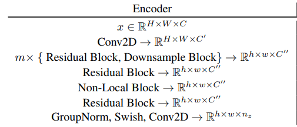
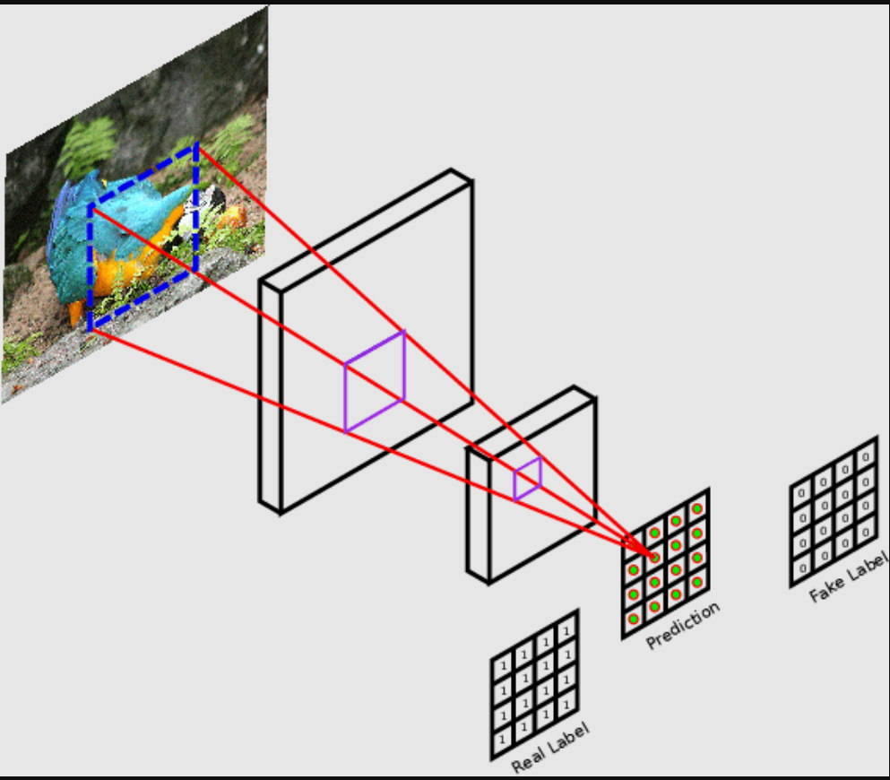
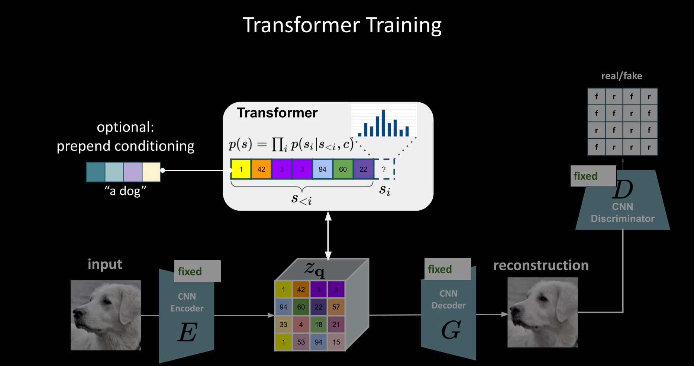
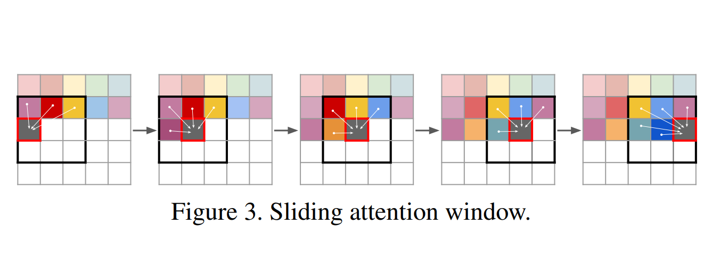

# PyTorch VQGAN

[](https://github.com/Shubhamai/pytorch-vqgan/blob/main/LICENSE)
[](https://github.com/Shubhamai/pytorch-vqgan/actions/workflows/main.yml)
[](https://codecov.io/gh/Shubhamai/pytorch-vqgan)

<p align="center">
<br>
<em>Figure 1. VQGAN Architecture</em>
</p>

> **Note:** This is a work in progress.


This repo purpose is to serve as a more cleaner and feature-rich implementation of the VQGAN - *[Taming Transformers for High-Resolution Image Synthesis](https://arxiv.org/abs/2010.11929)* from the initial work of [dome272's repo](https://github.com/dome272/VQGAN-pytorch) in PyTorch from scratch. There's also a great video on the [explanation of VQGAN](https://youtu.be/wcqLFDXaDO8) by dome272.  

I created this repo to better understand VQGAN myself, and to provide scripts for faster training and experimentation with a toy dataset like MNIST etc. I also tried to make it as clean as possible, with comments, logging, testing & coverage, custom datasets & visualizations, etc.   

- [PyTorch VQGAN](#pytorch-vqgan)
  - [What is VQGAN?](#what-is-vqgan)
    - [Stage 1](#stage-1)
      - [Training](#training)
    - [Generation](#generation)
    - [Stage 2](#stage-2)
  - [Setup](#setup)
  - [Usage](#usage)
    - [Training](#training-1)
    - [Testing](#testing)
    - [Visualizing](#visualizing)
    - [Tests](#tests)
  - [Notes](#notes)
    - [TODOs](#todos)
  - [Hardware requirements](#hardware-requirements)
  - [Shoutouts](#shoutouts)
  - [BibTeX](#bibtex)

## What is VQGAN?

VQGAN stands for **V**ector **Q**uantised **G**enerative **A**dversarial **N**etworks. The main idea behind this paper is to use CNN to learn the visual part of the image and generate a codebook of context-rich visual parts and then use Transformers to learn the long-range/global interactions between the visual parts of the image embedded in the codebook. Combining these two, we can generate very high-resolution images.

Learning both of these short and long-term interactions to generate high-resolution images is done in two different stages. 

1. The first stage uses VQGAN to learn the codebook of **context-rich** visual representation of the images. In terms of architecture, it is very similar to VQVAE in that it consists of an encoder, decoder and the codebook. We will learn more about this in the next section. 

<p align="center">
<br>
<em>Figure 2. VQVAE Architecture</em>
</p>

2. Using a transformer to learn the global interactions between the vectors in the codebook by predicting the next sequence from the previous sequences, to generate high-resolution images. 

---

### Stage 1

<p align="center">
<br>
<em>Stage 1 : VQGAN Architecture</em>
</p>


The architecture of VQGAN consists of majorly three parts, the encoder, decoder and the Codebook, similar to the VQVAE paper. 


1. The encoder [`encoder.py`](vqgan/encoder.py) part in the VQGAN learns to represent the images into a much lower dimension called embeddings or latent and consists of Convolution, Downsample, Residual blocks and special attention blocks ( Non-Local blocks ), around 30 million parameters in default settings. 
2. The embeddings are then quantized using CodeBook and the quantized embeddings are used as input to the decoder [`decoder.py`](vqgan/decoder.py) part. 
3. The decode takes the "quantized" embeddings and reconstructs the image. The architecture is similar to the encoder but reversed. Around 40 million parameters in default settings, slightly more compared to encoder due to more number of residual blocks. 

The main idea behind codebook and quantization is to convert the continuous latent representation into a discrete representation. The codebook is simply a list of `n` latent vectors ( which are learned while training ) which are then used to replace the latents generated from the encoder output with the closest vector ( in terms of distance ) from the codebook. The **VQ** part comes from here. 

#### Training

The training involves, sending the batch of images though the encoder, quantizing the embeddings and then sending the quantized embeddings through the decoder to reconstruct the image. The loss function is computed as follows:


$$
\begin{aligned}
\mathcal{L}_{\mathrm{VQ}}(E, G, \mathcal{Z})=\|x-\hat{x}\|^{2} &+\left\|\operatorname{sg}[E(x)]-z_{\mathbf{q}}\right\|_{2}^{2}+\left\|\operatorname{sg}\left[z_{\mathbf{q}}\right]-E(x)\right\|_{2}^{2} .
\end{aligned}
$$

The above equation represents the sum of reconstruction loss, alignment and commitment loss

1. Reconstruction loss

    > Appartely there is some confusion about is this  reconstruction loss was replaced with preceptual loss or it was a combination of them, we will go with what was implemented in the official code https://github.com/CompVis/taming-transformers/issues/40, which is l1 + perceptual loss

    


    The reconstruction loss is a sum of the l1 loss and perceptual loss.  
    $$\text { L1 Loss }=\sum_{i=1}^{n}\left|y_{\text {true }}-y_{\text {predicted }}\right|$$

    The preceptual is calculated the l2 distance between the last layer output of the generated vs original image from pre-trained model like VGG, etc. 

2. The alignment and commitment loss is from the quantization which compares the distance between the latent vectors from encoder output and the closest vector from the codebook. `sg` here means stop gradient function. 

    ---
  


$$
\mathcal{L}_{\mathrm{GAN}}(\{E, G, \mathcal{Z}\}, D)=[\log D(x)+\log (1-D(\hat{x}))]
$$

The above loss is for the discriminator which takes in real and generated images and learns to classify which one's real or face. the **GAN** in VQGAN comes from here :) 

The discrimination here is a bit different than conventional discriminators in that, instead of taking whole images as an input, they instead convert the images into patches using convolution and then predict which patch is real or fake.  

<br>

---

$$
\lambda=\frac{\nabla_{G_{L}}\left[\mathcal{L}_{\mathrm{rec}}\right]}{\nabla_{G_{L}}\left[\mathcal{L}_{\mathrm{GAN}}\right]+\delta}
$$

We calculate lambda as the ratio between the reconstruction loss and the GAN loss, both with respect to the gradient of the last layer of the decoder. `calculate_lambda` in [`vqgan.py`](vqgan/vqgan.py) 

The final loss then becomes  - 

$$
\begin{aligned}
\mathcal{Q}^{*}=\underset{E, G, \mathcal{Z}}{\arg \min } \max _{D} \mathbb{E}_{x \sim p(x)}\left[\mathcal{L}_{\mathrm{VQ}}(E, G, \mathcal{Z})+\lambda \mathcal{L}_{\mathrm{GAN}}(\{E, G, \mathcal{Z}\}, D)\right]
\end{aligned}
$$

which is the combination of the reconstruction loss, alignment loss and commitment loss and discriminator loss multiplied with `lambda`. 

### Generation


To generate the images from VQGAN, we generate the quantized vectors from [Stage 2](#stage-2) and pass it through the decoder to reconstruct the image.

---

### Stage 2

  <p align="center">
  <br>
  <em>Stage 2: Transformers</em>
  </p>




This stage contains Transformers 🤖 which are trained to predict the next latent vector from the sequence of previous latent vectors. 

Due to computation constraints, to generate high-resolution images, they use a sliding attention window to predict the next latent vector from its neighbor vectors in the quantized encoder output.   

## Setup 


## Usage

### Training

### Testing

### Visualizing

### Tests

I have also just started getting my feet wet with testing and automated testing with GitHub CI/CD, so the tests here might not be the best practices.

To run tests, run `pytest --cov-config=.coveragerc --cov=. test`

## Notes

### TODOs  

## Hardware requirements

## Shoutouts

The list here contains some helpful blogs or videos that helped me a bunch in understanding the VQGAN.

1. [The Illustrated VQGAN](https://ljvmiranda921.github.io/notebook/2021/08/08/clip-vqgan/) by Lj Miranda
2. [VQGAN: Taming Transformers for High-Resolution Image Synthesis [Paper Explained]](https://youtu.be/-wDSDtIAyWQ) by Gradient Dude
3. [VQ-GAN: Taming Transformers for High-Resolution Image Synthesis | Paper Explained](https://youtu.be/j2PXES-liuc) by The AI Epiphany
4. [VQ-GAN | Paper Explanation](https://youtu.be/wcqLFDXaDO8) and [VQ-GAN | PyTorch Implementation](https://youtu.be/_Br5WRwUz_U) by Outlier


## BibTeX

```
@misc{esser2020taming,
      title={Taming Transformers for High-Resolution Image Synthesis}, 
      author={Patrick Esser and Robin Rombach and Björn Ommer},
      year={2020},
      eprint={2012.09841},
      archivePrefix={arXiv},
      primaryClass={cs.CV}
}
```
